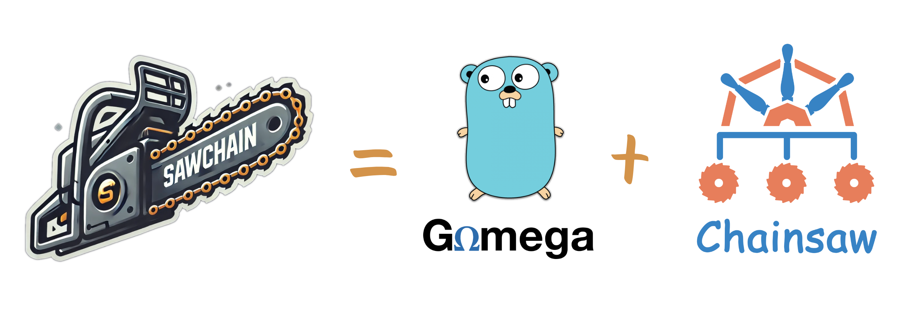

# What Is Sawchain?

Sawchain is a Go library for K8s YAML-driven testing—powered by [Chainsaw](https://github.com/kyverno/chainsaw)—with
helpers to reliably create/update/delete test resources, [Gomega](https://github.com/onsi/gomega)-friendly
APIs to simplify assertions, and more.



## Principles

### Powerful

* Enables completely YAML-driven testing
* Supports resource [templating](https://kyverno.github.io/chainsaw/latest/quick-start/resource-templating/)
* Performs [partial/subset matching](https://kyverno.github.io/chainsaw/latest/quick-start/assertion-trees/) on resource fields
* Facilitates comparisons [beyond simple equality](https://kyverno.github.io/chainsaw/latest/quick-start/assertion-trees/#beyond-simple-equality)

### Versatile

* Allows working with YAML, or structs, or both
* Provides high-level and low-level utilities for a wide range of scenarios
* Perfect for unit, integration, and end-to-end tests

### Compatible

* Offers [Gomega](https://github.com/onsi/gomega)-friendly APIs for comprehensive assertions
* Plugs into any framework implementing [testing.TB](https://pkg.go.dev/testing#TB), including [Ginkgo](https://github.com/onsi/ginkgo)
* Works with [controller-runtime](https://github.com/kubernetes-sigs/controller-runtime)'s generic
  [Client](https://pkg.go.dev/sigs.k8s.io/controller-runtime/pkg/client#Client) and
  [Object](https://pkg.go.dev/sigs.k8s.io/controller-runtime/pkg/client#Object) interfaces

## Capabilities

A peak at what Sawchain can do (see [usage notes](./usage-notes.md) and [API reference](./api-reference.md) for more detail)

### Check Resources

```go
// Check cluster for matching resources
var err error
err = sc.Check(ctx, template)        // Check for resource(s) using template
err = sc.Check(ctx, obj, template)   // Check for resource using single-document template, save first match to obj
err = sc.Check(ctx, objs, template)  // Check for resources using multi-document template, save first matches to objs

// Assert match found immediately
Expect(sc.Check(ctx, template)).To(Succeed())

// Assert match found eventually
Eventually(sc.CheckFunc(ctx, template)).Should(Succeed())
```

### Match Resources

```go
// Custom matchers (single resource only)
Expect(obj).To(sc.MatchYAML(template))                    // Assert client.Object matches Chainsaw template
Expect(obj).To(sc.HaveStatusCondition("Type", "Status"))  // Assert client.Object has specific status condition
```

### Get Resources

```go
// Get resources from the cluster
var err error
err = sc.Get(ctx, obj)             // Get resource using obj, save state to obj
err = sc.Get(ctx, template)        // Get resource(s) using template, don't save state
err = sc.Get(ctx, obj, template)   // Get resource using single-document template, save state to obj
err = sc.Get(ctx, objs)            // Get resources using objs, save state to objs
err = sc.Get(ctx, objs, template)  // Get resources using multi-document template, save state to objs

// Assert existence immediately
Expect(sc.Get(ctx, template)).To(Succeed())

// Assert existence eventually
Eventually(sc.GetFunc(ctx, template)).Should(Succeed())
```

### Fetch Resources

```go
// Get resources from the cluster and return state for matching
var fetchedObj client.Object
fetchedObj = sc.FetchSingle(ctx, obj)            // Fetch resource using obj, save state to obj
fetchedObj = sc.FetchSingle(ctx, template)       // Fetch resource using single-document template, don't save state
fetchedObj = sc.FetchSingle(ctx, obj, template)  // Fetch resource using single-document template, save state to obj

var fetchedObjs []client.Object
fetchedObjs = sc.FetchMultiple(ctx, objs)            // Fetch resources using objs, save state to objs
fetchedObjs = sc.FetchMultiple(ctx, template)        // Fetch resources using multi-document template, don't save state
fetchedObjs = sc.FetchMultiple(ctx, objs, template)  // Fetch resources using multi-document template, save state to objs

// Assert state immediately
Expect(sc.FetchSingle(ctx, template)).To(HaveField("Foo", "Bar"))
Expect(sc.FetchMultiple(ctx, template)).To(HaveEach(HaveField("Foo", "Bar")))

// Assert state eventually
Eventually(sc.FetchSingleFunc(ctx, template)).Should(HaveField("Foo", "Bar"))
Eventually(sc.FetchMultipleFunc(ctx, template)).Should(HaveEach(HaveField("Foo", "Bar")))
```

### List Resources

```go
// List all resources matching a template
var matches []client.Object
matches = sc.List(ctx, template)             // List matching resources using template
matches = sc.List(ctx, template, bindings)   // List matching resources using template with bindings

// Assert state of all matches immediately
Expect(sc.List(ctx, template)).To(HaveLen(3))
Expect(sc.List(ctx, template)).To(HaveEach(HaveField("Foo", "Bar")))

// Assert state of all matches eventually
Eventually(sc.ListFunc(ctx, template)).Should(HaveLen(3))
Eventually(sc.ListFunc(ctx, template)).Should(HaveEach(HaveField("Foo", "Bar")))
```

### Create Resources

```go
// Create resources and return client errors
var err error
err = sc.Create(ctx, obj)             // Create resource with obj
err = sc.Create(ctx, template)        // Create resource(s) with template, don't save state
err = sc.Create(ctx, obj, template)   // Create resource with single-document template, save state to obj
err = sc.Create(ctx, objs)            // Create resources with objs
err = sc.Create(ctx, objs, template)  // Create resources with multi-document template, save state to objs

// Test webhook
Expect(sc.Create(ctx, template)).NotTo(Succeed())

// Create resources, assert success, and wait for client to reflect changes
sc.CreateAndWait(ctx, obj)             // Create resource with obj
sc.CreateAndWait(ctx, template)        // Create resource(s) with template, don't save state
sc.CreateAndWait(ctx, obj, template)   // Create resource with single-document template, save state to obj
sc.CreateAndWait(ctx, objs)            // Create resources with objs
sc.CreateAndWait(ctx, objs, template)  // Create resources with multi-document template, save state to objs
```

### Update Resources

```go
// Update resources and return client errors
var err error
err = sc.Update(ctx, obj)             // Update resource with obj
err = sc.Update(ctx, template)        // Update resource(s) with template, don't save state
err = sc.Update(ctx, obj, template)   // Update resource with single-document template, save state to obj
err = sc.Update(ctx, objs)            // Update resources with objs
err = sc.Update(ctx, objs, template)  // Update resources with multi-document template, save state to objs

// Test webhook
Expect(sc.Update(ctx, template)).NotTo(Succeed())

// Update resources, assert success, and wait for client to reflect changes
sc.UpdateAndWait(ctx, obj)             // Update resource with obj
sc.UpdateAndWait(ctx, template)        // Update resource(s) with template, don't save state
sc.UpdateAndWait(ctx, obj, template)   // Update resource with single-document template, save state to obj
sc.UpdateAndWait(ctx, objs)            // Update resources with objs
sc.UpdateAndWait(ctx, objs, template)  // Update resources with multi-document template, save state to objs
```

### Delete Resources

```go
// Delete resources and return client errors
var err error
err = sc.Delete(ctx, obj)             // Delete resource with obj
err = sc.Delete(ctx, objs)            // Delete resources with objs
err = sc.Delete(ctx, template)        // Delete resource(s) with template

// Test webhook
Expect(sc.Delete(ctx, template)).NotTo(Succeed())

// Delete resources, assert success, and wait for client to reflect changes
sc.DeleteAndWait(ctx, obj)             // Delete resource with obj
sc.DeleteAndWait(ctx, objs)            // Delete resources with objs
sc.DeleteAndWait(ctx, template)        // Delete resource(s) with template
```

### Render Resources

```go
// Render a single object (return mode, generic)
obj := sc.RenderSingle(template, bindings)

// Render a single object (populate mode, type-safe)
secret := &corev1.Secret{}
sc.RenderSingle(secret, template, bindings)

// Render multiple objects (return mode, generic)
objs := sc.RenderMultiple(template, bindings)

// Render multiple objects (populate mode, type-safe)
secret := &corev1.Secret{}
configMap := &corev1.ConfigMap{}
sc.RenderMultiple([]client.Object{secret, configMap}, template, bindings)

// Render to a string
s := sc.RenderToString(template, bindings)

// Render to a file
sc.RenderToFile(filepath, template, bindings)
```
